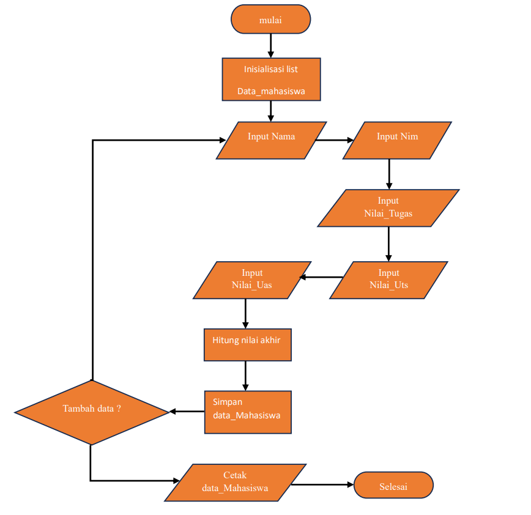
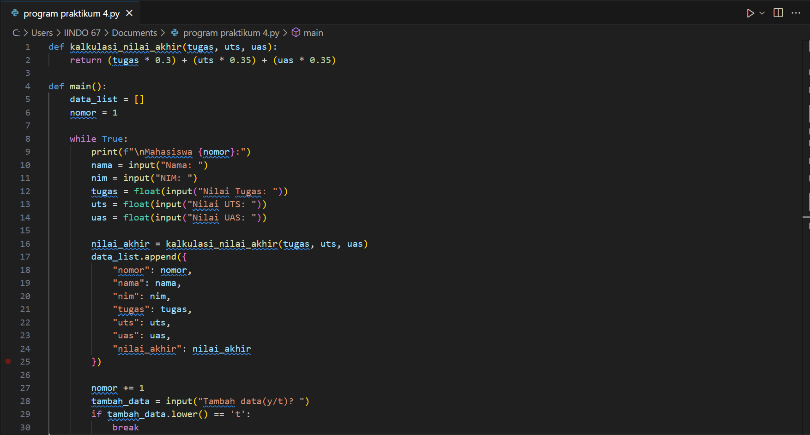
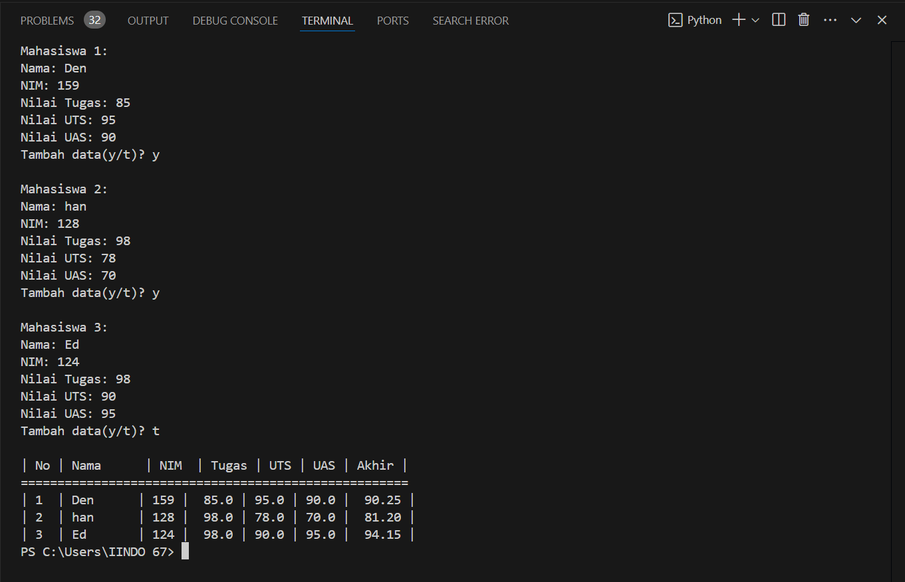

# praktikum-4-Den-fahmi
NAMA: DEN FAHMI SATRIA 

NIM: 312410523 

KELAS: T.I.24.A.5 

MATA KULIAH: BAHASA PEMOGRAMAN 

## program sederhana menambahkan data ke dalam sebuah list 
### berikut flowchart nya
 

### Penjelasan
Mulai: Proses dimulai. 

Inisialisasi list Data_mahasiswa: Membuat list untuk menyimpan data mahasiswa. 

Input Nama: Memasukkan nama mahasiswa. 

Input NIM: Memasukkan NIM (Nomor Induk Mahasiswa). 

Input Nilai_Tugas: Memasukkan nilai tugas mahasiswa. 

Input Nilai_UTS: Memasukkan nilai UTS (Ujian Tengah Semester) mahasiswa. 

Input Nilai_UAS: Memasukkan nilai UAS (Ujian Akhir Semester) mahasiswa. 

Hitung nilai akhir: Menghitung nilai akhir mahasiswa berdasarkan nilai tugas, UTS, dan UAS menggunakan formula (tugas * 0.3) + (uts * 0.35) + (uas * 0.35). 

Simpan data_Mahasiswa: Menyimpan data mahasiswa yang telah diinput dan dihitung ke dalam list data_list. 

Tambah data?: Mengecek apakah ada data mahasiswa lain yang ingin ditambahkan. Jika ya, kembali ke langkah Input Nama. Jika tidak, lanjut ke langkah berikutnya. 

Cetak data_Mahasiswa: Mencetak data mahasiswa yang telah disimpan dalam bentuk tabel. 

Selesai: Proses selesai. 

## berikut adalah Program Python yang di buat berdasarkan Flowchart di atas

## dan ini hasil eksekusi nya
 
